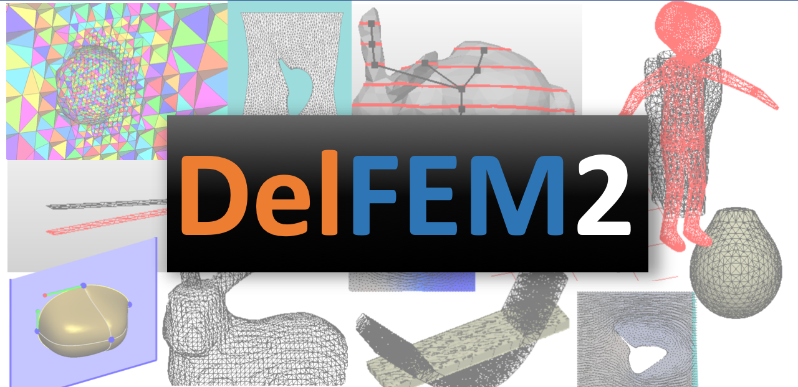

<a href="http://doge.mit-license.org"></a> 

| Linux  | Windows  |
|----|----|
| [](https://github.com/nobuyuki83/delfem2/actions/workflows/ci_linux.yml) |  |


# DelFEM2

DelFEM2 is a end-to-end framework for geometry processing and FEM simulation covering wide range of components including shape editing, meshing, FEM simulation, linear solver, variational mesh deformer, and visualization. DelFEM2 is aiming to be an interactive digital engineering and authoring tool.

**There is a python binding available at** 
+ [PyDelFEM2](https://github.com/nobuyuki83/pydelfem2) (deprecated)
+ [delfem2-python-bindings](https://github.com/nobuyuki83/delfem2-python-bindings) (maintained)

The implementation is based on my old open source project [DelFEM](https://github.com/nobuyuki83/DelFEM) library


***
# Manual &  Tutorial

There are currently no tutorial available for this library. To understand the code, please look at the exaxmples and tests  under following directoris.

+ examples using legacy OpenGL
  + [examples_oldgl_glfw](examples_oldgl_glfw):  dependency: GLFW
  + [examples_oldgl_glfw_glad](examples_oldgl_glfw_glad): dependencies: GLFW and glad (shader,FBO)
  + [examples_oldgl_glfw_cnpy](examples_oldgl_glfw_cnpy): dependencies: GLFW and cnpy (SMPL)
  + [examples_oldgl_glfw_pugixml](examples_oldgl_glfw_pugixml): dependencies: GLFW and pugixml (Metashape)
  + [examples_oldgl_glfw_tinygltf](examples_oldgl_glfw_tinygltf): dependencies: GLFW and tinygltf
  + [examples_oldgl_glfw_eigen](examples_oldgl_glfw_eigen): dependencies: GLFW and Eigen
  + [examples_oldgl_glut](examples_oldgl_glut):  dependency: GLUT
+ examples usigng modern OpenGL
  + [examples_newgl_glfw](examples_newgl_glfw):  dependency: GLFW
  + [examples_newgl_glfw_imgui](examples_newgl_glfw_imgui):  dependencies: GLFW and imgui
+ examples using CUDA (GPU parallerism)
  + [examples_cuda](examples_cuda)
+ examples using Alembic (offline simulation)
  + [examples_alembic](examples_alembic)
+ C++ test:
  + [test_cpp](test_cpp): tests using C++
  + [test_cpp/cuda](test_cpp/cuda) : test using cuda
  + [test_cpp/eigen](test_cpp/eigen) : test using eigen

See [docs/coding.md](docs/coding.md) for the coding convention. 

Please also checkout these alternative opensource projects [CGAL](https://www.cgal.org/), [libIGL](https://github.com/libigl/libigl).


***
# Install

No installation is necessary to use DelFEM2. All the source code of DelFEM2 can be download using git using the following command:
```
git clone https://github.com/nobuyuki83/delfem2.git
```

DelFEM2 can be compiled either as a header-only library or as a static library. Nothing complicated is necessary if DelFEM2 is used as a header only library -- just by include header files. To use DelFEM2 as a static library, you may compiles the delfem2 codes with option ```DFM2_STATIC_LIBRARY``` and several dependent DelFEM2 source files and link them manually (this is not very complicated too).


### Dependency & Binding

DelFEM2 does not have **any** external dependency. However, for some functionality such as OpenGL or Unit Test, you many need to download dependent repositories and compile them together. 

Currently DelFEM support binding to the following C++ open source projects.

- glfw
- glad
- cereal
- alembic
- googletest
- cnpy
- zlib
- imgui
- tinygltf
- stb

One can download **all** the dependent C++ repositories with

```bash
git submodle update --init
```

This command downloads all the external third party codes into the directory ```delfem2/3rd_party``` (This operation might take few minutes).  Or, one can download a specific dependent repository one-by-one with command

```bash
git submodule update --init 3rd_party/<name_of_repository>
```

Note that, DelFEM2 is distributed under the MIT licence, but these dependent libraries may affect the license. 


***
# Licence, Copyright & Contact

DelFEM2 is distributed under the [MIT licence](https://github.com/nobuyuki83/delfem2/blob/master/LICENSE). 

In a nut shell, it is free to use/distribute this software commercially for any purpose. But please always keep the copyright notice below and the MIT lisence statement.


	Copyright (C) Nobuyuki Umetani 2021

If DelFEM2 contributes to an academic publication, cite it as:


```
@misc{delfem2,
  title = {DelFEM2},
  author = {Nobuyuki Umetani},
  note = {https://github.com/nobuyuki83/delfem2},
  year = {2019}
}
```

DelFEM2 is currently developed and maintained by [Nobuyuki Umetani](http://www.nobuyuki-umetani.com/). If you have questions or comments please [contact via email](mailto:n.umetani@gmail.com).

